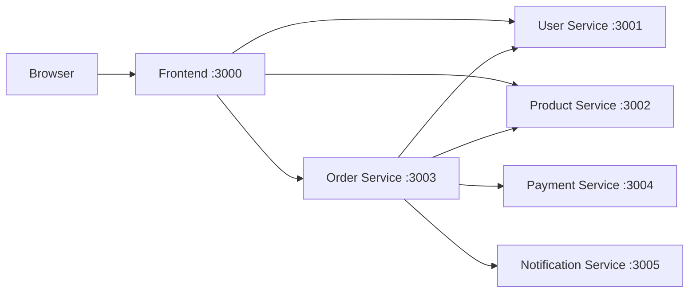
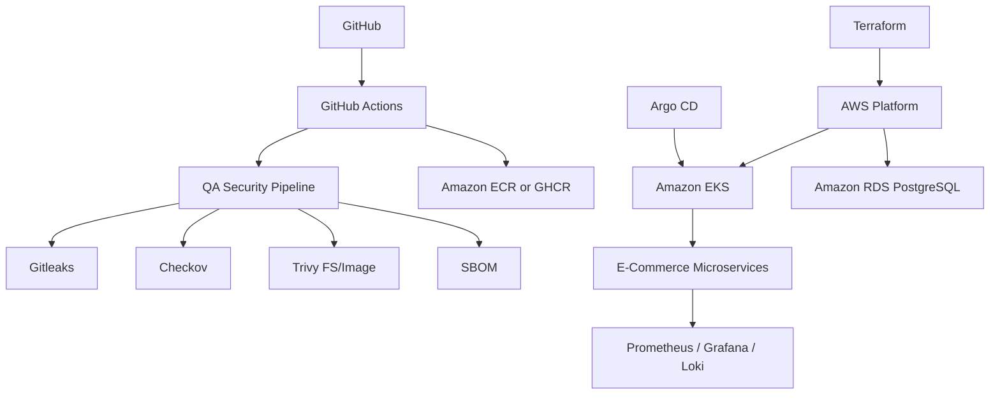
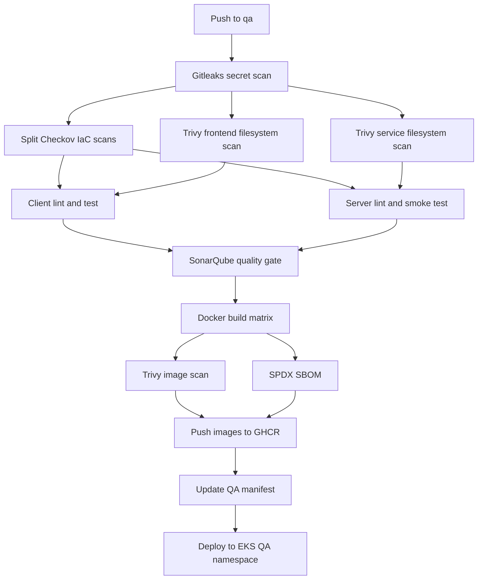

# Architecture

## Local Phase

## Target AWS Phase

## QA Pipeline Architecture

## Service Responsibilities

User service:

- Demo customer profile endpoint
- Health endpoint

Product service:

- Product catalogue, details, inventory and delivery estimate endpoints
- Health endpoint

Order service:

- Order creation and order history endpoints
- Calculates totals and shipping
- Calls user and product services during checkout
- Calls payment service
- Calls notification service

Payment service:

- Mock payment authorization
- Payment record listing
- Health endpoint

Notification service:

- Mock notification dispatch
- Notification record listing
- Health endpoint
