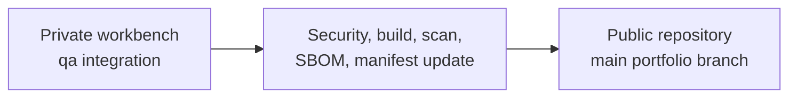
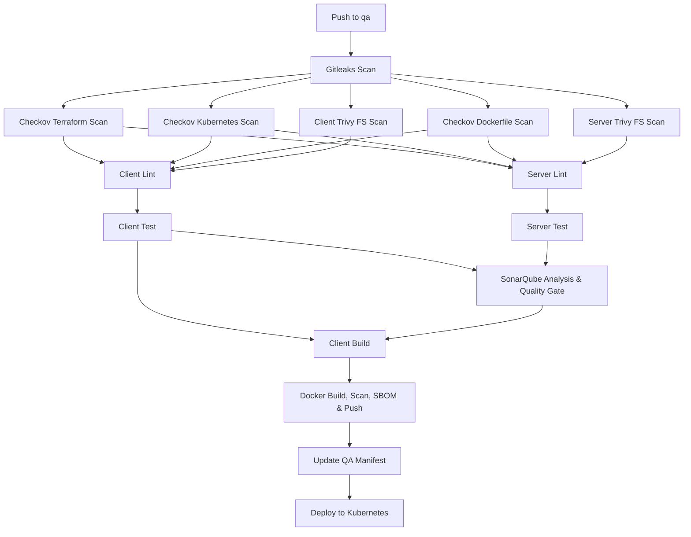

# CI/CD Pipeline

This project uses a QA-first DevSecOps delivery flow in the private workbench repository, then publishes stable output to this public portfolio repository.

## Branch Flow



Development work is committed to the private workbench `qa` branch. CI/CD runs there. Once the project is stable, polished code and public-safe documentation are exported to public `main`.

## QA Pipeline

The QA pipeline is implemented from:

```text
.github/workflows/qa-cicd.yml
```

The flow mirrors the requested enterprise QA pipeline while using this repository's actual microservice layout:

- `apps/frontend` is the client surface.
- `services/*` is the server surface.
- `kubernetes/overlays/qa` is the QA manifest target.
- `ghcr.io/deucesdevops/enterprise-devsecops-eks-platform/*` is the image namespace.

Current QA stages:



## Current Security Behavior

Gitleaks, Checkov, and Trivy generate downloadable reports without blocking the early portfolio pipeline on findings. This follows the requested flow's `--exit-code 0` and `|| true` pattern, which is useful while the baseline is being introduced.

SonarQube runs when `SONAR_TOKEN` and `SONAR_HOST_URL` repository secrets are configured. Until then, the workflow uploads a skip report and continues.

The next hardening step is to convert high-confidence scan findings into blocking quality gates.

## Active Now

- Secret scanning
- Separate Terraform, Kubernetes, and Dockerfile IaC scanning
- Frontend filesystem vulnerability scanning
- Backend service filesystem vulnerability scanning
- Client and server lint stages
- Client syntax test and server smoke test stages
- Conditional SonarQube quality gate
- Client build artifact
- Docker image build matrix for all six runtime images
- Trivy image reports in JSON and table formats
- Source and image SBOM generation
- Push to GHCR with SHA and `latest` tags
- Automatic QA manifest image tag update
- Conditional EKS QA deployment

## Required Repository Configuration

The pipeline can build, scan, publish GHCR packages, and update manifests with the default `GITHUB_TOKEN`. These deployment features require additional setup:

- `SONAR_TOKEN` secret and `SONAR_HOST_URL` secret for SonarQube.
- `AWS_ROLE_TO_ASSUME` secret for GitHub OIDC deployment to EKS.
- `AWS_REGION` repository variable, optional default: `us-east-1`.
- `EKS_CLUSTER_NAME` repository variable, optional default: `devsecops-commerce-qa`.
- QA namespace: `devsecops-commerce-qa`.

If `AWS_ROLE_TO_ASSUME` is not configured, the deployment job records a skipped deployment artifact instead of failing the QA pipeline.

## Deferred Until AWS/EKS Exists

These stages are intentionally not active yet:

- QA sign-off automation
- Retag and push QA image to prod registry
- Deploy to EKS prod namespace

Those stages require Phase 3 infrastructure:

- AWS account and IAM role strategy
- EKS QA and prod namespaces
- Kubernetes deployment credentials
- Terraform remote state

## Production Promotion

Production deployment should happen only after:

1. Private workbench `qa` passes the QA pipeline.
2. Manual QA/regression testing is complete.
3. Polished, public-safe changes are promoted to public `main`.
4. The production CD workflow retags/promotes the tested image.
5. Production manifests are updated with the approved image tag.
6. EKS production deployment succeeds.
